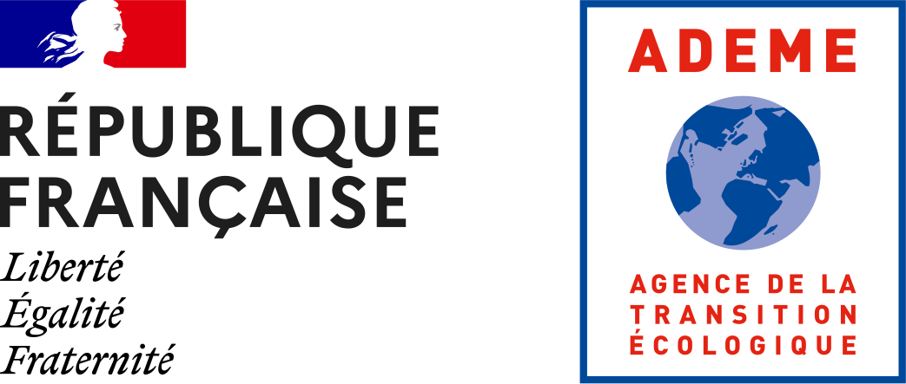

.. poem documentation master file, created by
   sphinx-quickstart on Mon May 27 11:19:11 2024.
   You can adapt this file completely to your liking, but it should at least
   contain the root `toctree` directive.

========================================
Performance pOlar Exchange forMat (POEM)
========================================

This document describes the **POEM File Format Specifications**. It is proposed by *D-ICE ENGINEERING*
to the Wind-Propulsion community. It is intended to provide a common efficient solution to store and
manipulate multidimensional polar data tables generated by Performance Prediction Programs or
other means and read by Weather Routing solutions.

* **POEM Files** ARE purely *NetCDF-4* (https://www.unidata.ucar.edu/software/netcdf/) files and are I/O compatible
  with any library that deals with *NetCDF-4 standards*.
* **POEM File Format Specifications* introduce a set of rules to organise data into a *NetCDF-4* file to make a valid **POEM
  File**, understood by the **POEM Library**.
* **POEM Library** is a C++ library that defines data structures to be integrated into applicative
  software such as VPP/PPP software to generate performance polar tables, visualisation
  software, weather routing solutions, embedded systems etc. It also provides fast algorithms
  to interpolate on multidimensional polar tables.
* **POEM Executable** is a command line utility to manipulate POEM files (clean, gerify version compliance etc...)

.. warning::
   This document is preliminary, not publicly available (yet) and has been shared with you upon request.
   A version of this document is currently under active development along with extended POEM File Format Specifications. It will be made freely available to anyone in the frame of the ADEME-funded project OPERVENT, by late 2024.

   Please DO NOT SHARE the present document unless you get written permission from D-ICE ENGINEERING.

   For any questions, please contact François Rongère <francois.rongere@dice-engineering.com>

POEM File Format Specification versions
=======================================
.. toctree::
   :maxdepth: 1

    v0/index.rst
..    v1/index.rst

.. note::
    Version 1 of the standard is under construction and should be released in February 2025

POEM is made Open Source with the support of the French Agency for Ecological Transition (OPERVENT project, 2024)

.. TODO: ajouter logo D-ICE